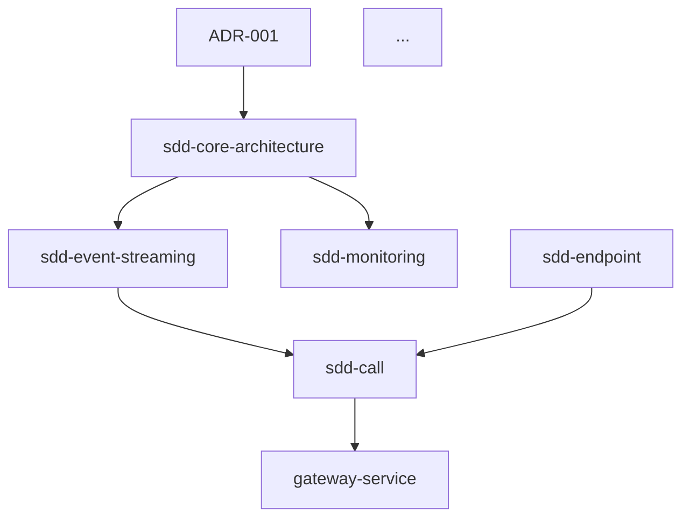

# Dependencies Graph Flow

## Command: /dependencies

Builds dependency graphs between ADR/SDD/DDD/TDD/VDD flows and identifies the critical path.

## Usage

```bash
/dependencies                    # Full analysis + graph + critical path
/dependencies graph              # Build dependency graph only
/dependencies critical-path      # Calculate critical path only
/dependencies status             # Show dependency status
```

## Initialization

**Before any execution**, check if `flows/dependencies/` exists:

```
IF flows/dependencies/ does NOT exist:
  1. Copy flows/.templates/dependencies/ → flows/dependencies/
  2. Create graph.md template
  3. Create critical-path.md template
  4. Create README.md
  5. Inform user: "Initialized dependencies workspace from templates"
  6. Continue with execution
```

## Execution Model

**This command MUST run in a separate subagent:**

```
Main Agent
    │
    └─► Delegate to subagent (general-purpose)
            │
            ├─► Scan all flows
            ├─► Extract dependencies
            ├─► Build graph
            ├─► Calculate critical path
            └─► Return results
```

## Algorithm

### Step 1: Scan All Flows

**For each flow directory:**

1. **SDD flows** (`flows/sdd-*/`):
   - Read `01-requirements.md` → extract dependencies section
   - Read `02-specifications.md` → extract interface dependencies
   - Read `03-plan.md` → extract task dependencies

2. **DDD flows** (`flows/ddd-*/`):
   - Read `01-stakeholder-requirements.md` → extract dependencies
   - Read `02-specifications.md` (if exists)

3. **TDD flows** (`flows/tdd-*/`):
   - Read `01-requirements.md` → extract test dependencies
   - Read `01-test-specifications.md` → extract system under test

4. **VDD flows** (`flows/vdd-*/`):
   - Read `01-visual-requirements.md` → extract UI dependencies
   - Read `01-visual-specs.md` → extract component dependencies

5. **ADR flows** (`flows/adr-*/`):
   - Read `adr.md` → extract related decisions
   - Extract "depends on" / "enables" / "conflicts with"

### Step 2: Extract Dependencies

**Dependency Types:**

| Type | Description | Example |
|------|-------------|---------|
| **requires** | Hard dependency, must exist first | sdd-call requires sdd-endpoint |
| **enables** | Soft dependency, enables functionality | sdd-endpoint enables sdd-call |
| **references** | Informational reference | sdd-call references ADR-001 |
| **conflicts** | Incompatible with | sdd-v1 conflicts sdd-v2 |
| **supersedes** | Replaces/updates | sdd-v2 supersedes sdd-v1 |

**Extraction Patterns:**

```markdown
# In requirements/specifications

## Dependencies
- Depends on: [flow-name]
- Requires: [flow-name]
- References: [flow-name]

## Related Documents
- ADR-XXX: [description]
- flows/sdd-[name]/

## Interfaces
- Uses: [interface-name] from [flow-name]
- Provides: [interface-name] for [flow-name]
```

### Step 3: Build Dependency Graph

**Graph Structure:**

```
nodes: [
  { id: "sdd-call", type: "SDD", layer: 1 },
  { id: "sdd-endpoint", type: "SDD", layer: 1 },
  { id: "ADR-001", type: "ADR", status: "approved" },
  ...
]

edges: [
  { from: "sdd-call", to: "sdd-endpoint", type: "requires" },
  { from: "sdd-call", to: "ADR-001", type: "references" },
  { from: "sdd-endpoint", to: "sdd-core-architecture", type: "requires" },
  ...
]
```

**Graph Output** (`flows/dependencies/graph.md`):

```markdown
# Dependency Graph

Generated: [timestamp]

## Nodes by Type

| Type | Count |
|------|-------|
| SDD | 27 |
| DDD | 2 |
| TDD | 8 |
| VDD | 4 |
| ADR | 5 |

## Nodes by Layer

| Layer | Count |
|-------|-------|
| L0 (Infrastructure) | 6 |
| L1 (Domain) | 19 |
| L2 (Features) | 12 |

## Edges by Type

| Type | Count |
|------|-------|
| requires | 45 |
| enables | 23 |
| references | 67 |
| conflicts | 2 |
| supersedes | 1 |

## Visual Graph (Mermaid)



## Dependency Matrix

| From | To | Type | Strength |
|------|-----|------|----------|
| sdd-call | sdd-endpoint | requires | high |
| sdd-call | sdd-call-model | requires | high |
| gateway-service | sdd-sip | requires | high |
| gateway-service | sdd-telephony | requires | high |
```

### Step 4: Calculate Critical Path

**Critical Path Algorithm:**

1. **Identify entry points** (nodes with no incoming edges)
2. **Identify exit points** (nodes with no outgoing edges)
3. **Calculate longest path** from entry to exit
4. **Mark critical nodes** (nodes on longest path)

**Critical Path Output** (`flows/dependencies/critical-path.md`):

```markdown
# Critical Path

Generated: [timestamp]

## Critical Path (Longest Dependency Chain)

```
sdd-core-architecture 
    └─► sdd-event-streaming 
        └─► sdd-call-model 
            └─► sdd-call 
                └─► gateway-service 
                    └─► voip-calling
```

**Path Length**: 6 nodes

## Critical Nodes

| Node | Type | Layer | Impact if blocked |
|------|------|-------|-------------------|
| sdd-core-architecture | SDD | L0 | Blocks ALL flows |
| sdd-event-streaming | SDD | L0 | Blocks all event-driven flows |
| sdd-call-model | SDD | L1 | Blocks call features |
| sdd-call | SDD | L1 | Blocks gateway routing |
| gateway-service | SDD | L1 | Blocks VoIP feature |
| voip-calling | DDD | L2 | End-user feature blocked |

## Non-Critical Paths

Paths that can be developed in parallel:

1. **SMS/SMPP Path** (parallel to critical):
   ```
   sdd-sms-smpp ──► sms-service
   ```

2. **UI Path** (parallel to critical):
   ```
   vdd-ui-theming ──► vdd-call-ui
   ```

3. **Testing Path** (parallel to critical):
   ```
   tdd-testing ──► [all test modules]
   ```

## Risk Analysis

| Risk | Probability | Impact | Mitigation |
|------|-------------|--------|------------|
| sdd-core-architecture blocked | Low | Critical | Already complete |
| sdd-event-streaming blocked | Low | High | Fallback to direct calls |
| sdd-call blocked | Medium | High | Prioritize resources |

## Recommendations

1. **Priority 1**: Complete critical path nodes first
2. **Priority 2**: Develop parallel paths concurrently
3. **Priority 3**: Defer non-essential features
```

### Step 5: Update Waterfall Status

**Sync with waterfall:**

```markdown
## Dependencies

- Critical path identified: 6 nodes
- Parallel paths: 3
- Blocking dependencies: 45
- See: `flows/dependencies/graph.md`, `flows/dependencies/critical-path.md`
```

## Output Files

| File | Purpose |
|------|---------|
| `flows/dependencies/graph.md` | Full dependency graph |
| `flows/dependencies/critical-path.md` | Critical path analysis |
| `flows/dependencies/README.md` | Documentation |
| `flows/waterfall/_status.md` | Updated with dependency info |

## Subagent Delegation

**Delegate to subagent:**

```
Task: Build dependency graph and critical path

Prompt:
1. Scan all flows in flows/sdd-*/, flows/ddd-*/, flows/tdd-*/, flows/vdd-*/, flows/adr-*/
2. Extract dependencies from requirements, specifications, plans, ADRs
3. Build dependency graph (nodes + edges)
4. Calculate critical path (longest dependency chain)
5. Identify parallel development paths
6. Generate graph.md and critical-path.md
7. Return summary to main agent
```

## Best Practices

### Do
- Run in separate subagent to avoid context pollution
- Update graph when flows change
- Reference critical path in implementation planning
- Identify parallel paths for concurrent development

### Don't
- Block on circular dependencies (flag them)
- Include trivial dependencies (noise)
- Forget to update when flows are added/removed
- Ignore conflict edges

---

*Created: 2026-03-04*
*Version: 1.0*
